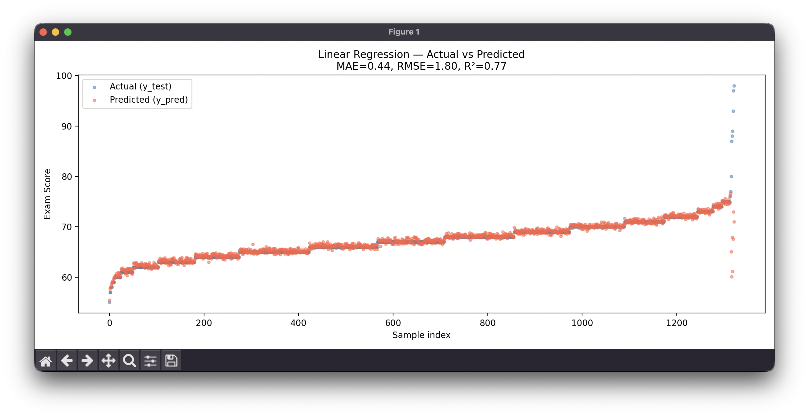
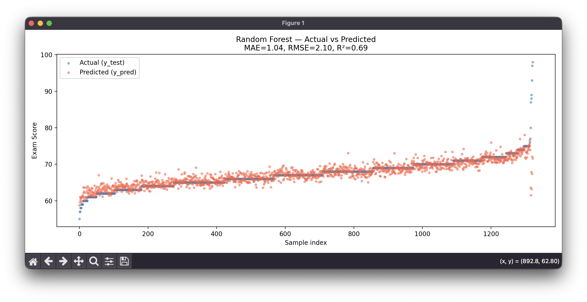

# Machine Learning Models Comparison

This project explores and compares machine learning models for two classic problem types: **regression** and **classification**.

---

## Goals

- Compare different ML models against each other on the same dataset
- Compare models from the **scikit-learn library** against models **implemented from scratch**
- Gain hands-on understanding of how algorithms work under the hood

---

## Problem Types

### Regression
Predicting a continuous numerical value based on input features.

### Classification
*(coming soon)*
Predicting a discrete class label based on input features.

---

## Models

### Regression
| Model | Source | Parameters | Scaling |
|-------|--------|------------|---------|
| Linear Regression | scikit-learn | default | Standardization |
| Ridge Regression | scikit-learn | alpha=10.0 | Standardization |
| Lasso Regression | scikit-learn | alpha=1.0 | Standardization |
| Random Forest Regressor | scikit-learn | n_estimators=100, max_depth=20, min_samples_split=2, min_samples_leaf=3 | none |
| XGBoost Regressor | scikit-learn | n_estimators=200, max_depth=4, learning_rate=0.06, subsample=0.4, colsample_bytree=0.6 | none |
| SVR | scikit-learn | kernel=rbf, C=10.0, epsilon=0.1, gamma=scale | Standardization |
| Linear Regression | implemented from scratch | — | — |

### Classification
*(coming soon)*

---

## Custom Implementations from Scratch

Beyond the models themselves, the following ML utilities were implemented manually to understand their internals:

- **train_test_split** — splitting data into training and test sets
- **Standardization** — zero mean, unit variance scaling (Standard Scaler)
- **Normalization** — min-max scaling to [0, 1] range
- **Metrics** — MAE, RMSE, R², accuracy, and others

---

## Regression Dataset — Student Performance

**Source:** [Student Exam Performance Dataset — Kaggle](https://www.kaggle.com/datasets/grandmaster07/student-exam-performance-dataset-analysis)
**File:** `Regression/studentperform.csv`
**Rows:** ~6,607 students
**Target variable:** `Exam_Score` — the final exam score of a student (continuous value)

### Features

| Feature | Type | Description |
|---------|------|-------------|
| Hours_Studied | Numerical | Weekly hours spent studying |
| Attendance | Numerical | Attendance percentage |
| Sleep_Hours | Numerical | Average hours of sleep per night |
| Previous_Scores | Numerical | Scores from previous exams |
| Tutoring_Sessions | Numerical | Number of tutoring sessions per month |
| Physical_Activity | Numerical | Weekly hours of physical activity |
| Parental_Involvement | Categorical (Low/Medium/High) | Level of parental involvement |
| Access_to_Resources | Categorical (Low/Medium/High) | Access to study resources |
| Extracurricular_Activities | Binary (Yes/No) | Participation in extracurricular activities |
| Motivation_Level | Categorical (Low/Medium/High) | Student's motivation level |
| Internet_Access | Binary (Yes/No) | Whether the student has internet access |
| Family_Income | Categorical (Low/Medium/High) | Family income level |
| Teacher_Quality | Categorical (Low/Medium/High) | Quality of teachers |
| School_Type | Categorical (Public/Private) | Type of school |
| Peer_Influence | Categorical (Negative/Neutral/Positive) | Influence of peers on studying |
| Learning_Disabilities | Binary (Yes/No) | Presence of learning disabilities |
| Parental_Education_Level | Categorical | Highest education level of parents |
| Distance_from_Home | Categorical (Near/Moderate/Far) | Distance from home to school |
| Gender | Categorical (Male/Female) | Student's gender |

### Preprocessing
- Missing values: rows with >70% missing dropped; numerical columns filled with median, categorical with mode
- Binary columns encoded as 0/1
- Ordered categoricals (Low/Medium/High) label-encoded
- Nominal categoricals (Gender, School_Type) one-hot encoded
- Numerical features standardized (Standard Scaler) for linear models

---

## Regression Results

Results saved to `Regression/results.txt` after each run.

| Model | MAE | RMSE | R² |
|-------|-----|------|----|
| Linear Regression | 0.44 | 1.80 | 0.77 |
| Ridge (alpha=1.0) | 0.44 | 1.80 | 0.77 |
| Ridge (alpha=10.0) | 0.44 | 1.80 | 0.77 |
| SVR (kernel=rbf, C=10.0, epsilon=0.1) | 0.47 | 1.82 | 0.77 |
| Lasso (alpha=0.1) | 0.68 | 1.88 | 0.75 |
| XGBoost | 0.64 | 1.88 | 0.75 |
| Random Forest | 1.04 | 2.10 | 0.69 |
| Lasso (alpha=1.0) | 1.91 | 2.82 | 0.44 |

> **Best model:** Linear Regression / Ridge (alpha=1.0 or 10.0) — R²=0.77, MAE=0.44, RMSE=1.80

---

## Visualizations

### Linear Regression — Actual vs Predicted



### Random Forest — Actual vs Predicted



---

## Project Structure

```
machine learning models/
├── README.md
└── Regression/
    ├── studentperform.csv
    ├── results.txt
    ├── data_clean.py               # preprocessing & scaling utilities
    ├── Linear_regression_fromsklearn.py
    ├── Ridge_fromsklearn.py
    ├── Lasso_fromsklearn.py
    ├── RandomForest_fromsklearn.py
    ├── Xgboost_fromsklearn.py
    └── SVR_fromsklearn.py
```
