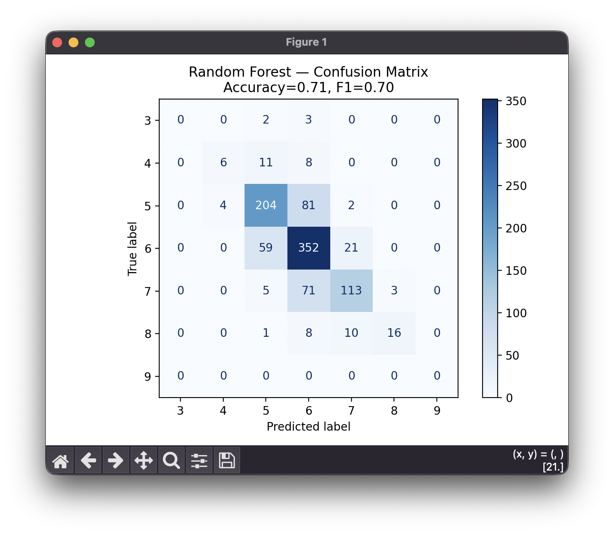
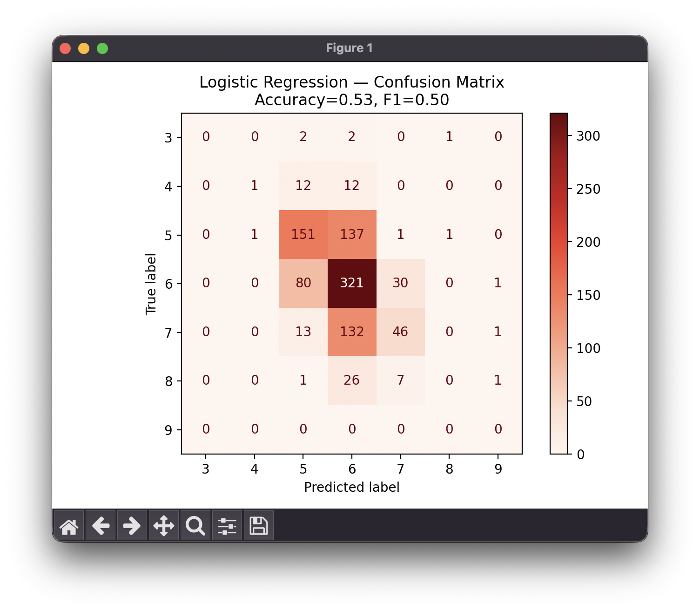
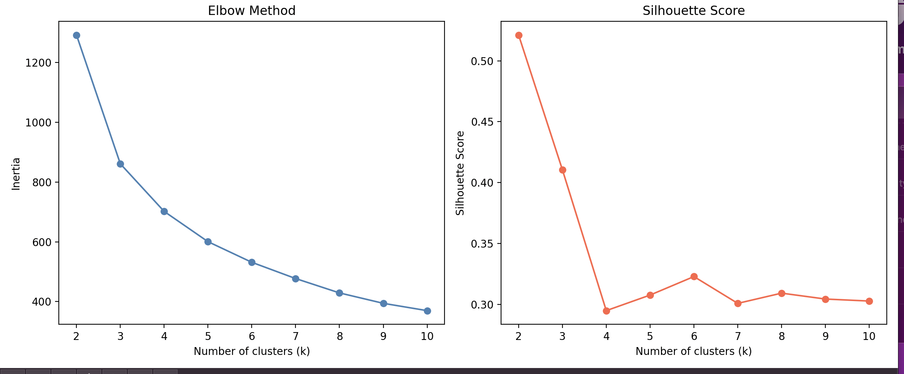

# Machine Learning Models Comparison

This project explores and compares machine learning models for three problem types: **regression**, **classification**, and **clustering**.

---

## Goals

- Compare different ML models against each other on the same dataset
- Compare models from the **scikit-learn library** against models **implemented from scratch**
- Gain hands-on understanding of how algorithms work under the hood

---

## Problem Types

### Regression
Predicting a continuous numerical value based on input features.

### Classification
Predicting a discrete class label based on input features.

### Clustering
Finding natural groupings in data without labeled examples (unsupervised learning).

---

## Models

### Regression
| Model | Source | Parameters | Scaling |
|-------|--------|------------|---------|
| Linear Regression | scikit-learn | default | Standardization |
| Ridge Regression | scikit-learn | alpha=10.0 | Standardization |
| Lasso Regression | scikit-learn | alpha=1.0 | Standardization |
| Random Forest Regressor | scikit-learn | n_estimators=100, max_depth=20, min_samples_split=2, min_samples_leaf=3 | none |
| XGBoost Regressor | scikit-learn | n_estimators=200, max_depth=4, learning_rate=0.06, subsample=0.4, colsample_bytree=0.6 | none |
| SVR | scikit-learn | kernel=rbf, C=10.0, epsilon=0.1, gamma=scale | Standardization |
| Linear Regression | implemented from scratch | — | — |

### Classification
| Model | Source | Parameters | Scaling |
|-------|--------|------------|---------|
| Logistic Regression | scikit-learn | max_iter=10000, solver=saga, C=6.0 | Standardization |
| Random Forest Classifier | scikit-learn | n_estimators=300, max_depth=30, min_samples_split=2, min_samples_leaf=1 | none |
| XGBoost Classifier | scikit-learn | n_estimators=400, max_depth=5, learning_rate=0.1, subsample=0.8, colsample_bytree=0.8 | none |
| Decision Tree Classifier | scikit-learn | max_depth=30, min_samples_split=5, min_samples_leaf=1 | none |
| KNN | scikit-learn | n_neighbors=10, weights=distance, metric=euclidean | Standardization |
| SVM | scikit-learn | kernel=rbf, C=40.0, gamma=scale | Standardization |
| MLP | scikit-learn | hidden_layer_sizes=(128, 64, 32), activation=relu, learning_rate_init=0.0005 | Standardization |

### Clustering
Finding natural groupings in data without labeled examples.

| Model | Source | Parameters |
|-------|--------|------------|
| KMeans | scikit-learn | n_clusters=2 (optimal by silhouette), n_init=10 |
| DBSCAN | scikit-learn | coming soon |

---

## Custom Implementations from Scratch

Beyond the models themselves, the following ML utilities were implemented manually to understand their internals:

- **train_test_split** — splitting data into training and test sets
- **Standardization** — zero mean, unit variance scaling (Standard Scaler)
- **Normalization** — min-max scaling to [0, 1] range
- **Metrics** — MAE, RMSE, R², accuracy, and others

---

## Regression Dataset — Student Performance

**Source:** [Student Exam Performance Dataset — Kaggle](https://www.kaggle.com/datasets/grandmaster07/student-exam-performance-dataset-analysis)
**File:** `Regression/studentperform.csv`
**Rows:** ~6,607 students
**Target variable:** `Exam_Score` — the final exam score of a student (continuous value)

### Features

| Feature | Type | Description |
|---------|------|-------------|
| Hours_Studied | Numerical | Weekly hours spent studying |
| Attendance | Numerical | Attendance percentage |
| Sleep_Hours | Numerical | Average hours of sleep per night |
| Previous_Scores | Numerical | Scores from previous exams |
| Tutoring_Sessions | Numerical | Number of tutoring sessions per month |
| Physical_Activity | Numerical | Weekly hours of physical activity |
| Parental_Involvement | Categorical (Low/Medium/High) | Level of parental involvement |
| Access_to_Resources | Categorical (Low/Medium/High) | Access to study resources |
| Extracurricular_Activities | Binary (Yes/No) | Participation in extracurricular activities |
| Motivation_Level | Categorical (Low/Medium/High) | Student's motivation level |
| Internet_Access | Binary (Yes/No) | Whether the student has internet access |
| Family_Income | Categorical (Low/Medium/High) | Family income level |
| Teacher_Quality | Categorical (Low/Medium/High) | Quality of teachers |
| School_Type | Categorical (Public/Private) | Type of school |
| Peer_Influence | Categorical (Negative/Neutral/Positive) | Influence of peers on studying |
| Learning_Disabilities | Binary (Yes/No) | Presence of learning disabilities |
| Parental_Education_Level | Categorical | Highest education level of parents |
| Distance_from_Home | Categorical (Near/Moderate/Far) | Distance from home to school |
| Gender | Categorical (Male/Female) | Student's gender |

### Preprocessing
- Missing values: rows with >70% missing dropped; numerical columns filled with median, categorical with mode
- Binary columns encoded as 0/1
- Ordered categoricals (Low/Medium/High) label-encoded
- Nominal categoricals (Gender, School_Type) one-hot encoded
- Numerical features standardized (Standard Scaler) for linear models

---

## Regression Results

Results saved to `Regression/results.txt` after each run.

| Model | MAE | RMSE | R² |
|-------|-----|------|----|
| Linear Regression | 0.44 | 1.80 | 0.77 |
| Ridge (alpha=1.0) | 0.44 | 1.80 | 0.77 |
| Ridge (alpha=10.0) | 0.44 | 1.80 | 0.77 |
| SVR (kernel=rbf, C=10.0, epsilon=0.1) | 0.47 | 1.82 | 0.77 |
| Lasso (alpha=0.1) | 0.68 | 1.88 | 0.75 |
| XGBoost | 0.64 | 1.88 | 0.75 |
| Random Forest | 1.04 | 2.10 | 0.69 |
| Lasso (alpha=1.0) | 1.91 | 2.82 | 0.44 |

> **Best model:** Linear Regression / Ridge (alpha=1.0 or 10.0) — R²=0.77, MAE=0.44, RMSE=1.80

---

## Classification Dataset — Wine Quality

**Source:** [Wine Quality Dataset — UCI Machine Learning Repository](https://archive.ics.uci.edu/dataset/186/wine+quality)
**File:** `Classification/winequality-white.csv`
**Rows:** ~4,898 white wines
**Target variable:** `quality` — wine quality score (3–9, multiclass classification)

### Features

All features are continuous numerical measurements:

| Feature | Description |
|---------|-------------|
| fixed acidity | Amount of fixed acids |
| volatile acidity | Amount of volatile acids (high = unpleasant taste) |
| citric acid | Amount of citric acid |
| residual sugar | Sugar remaining after fermentation |
| chlorides | Amount of salt |
| free sulfur dioxide | Free SO₂ (prevents microbial growth) |
| total sulfur dioxide | Total SO₂ |
| density | Density of wine |
| pH | Acidity level |
| sulphates | Sulphate additive level |
| alcohol | Alcohol percentage |

### Preprocessing
- No missing values
- All features standardized (Standard Scaler)

---

## Classification Results

Results saved to `Classification/results.txt` after each run.

| Model | Accuracy | Precision | Recall | F1 |
|-------|----------|-----------|--------|----|
| Random Forest | 0.71 | 0.71 | 0.71 | 0.70 |
| XGBoost | 0.69 | 0.69 | 0.69 | 0.69 |
| KNN (k=10, weights=distance) | 0.69 | 0.69 | 0.69 | 0.68 |
| MLP (128, 64, 32) | 0.67 | 0.67 | 0.67 | 0.67 |
| Decision Tree (max_depth=30) | 0.60 | 0.60 | 0.60 | 0.60 |
| SVM (kernel=rbf, C=40.0) | 0.60 | 0.60 | 0.60 | 0.59 |
| Logistic Regression | 0.53 | 0.52 | 0.53 | 0.50 |

> **Best model:** Random Forest — Accuracy=0.71, F1=0.70

---

## Visualizations

### Regression — Linear Regression — Actual vs Predicted


### Regression — Random Forest — Actual vs Predicted


### Classification — Random Forest — Confusion Matrix



### Classification — Logistic Regression — Confusion Matrix



---

## Clustering Dataset — Mall Customers

**Source:** [Mall Customer Segmentation Dataset — Kaggle](https://www.kaggle.com/datasets/hosseinbadrnezhad/mall-customer-segmentation-dataset)
**File:** `Clustering/store_customers.csv`
**Rows:** 1,000 mall customers
**Task:** Unsupervised segmentation — no target variable

### Features

| Feature | Type | Description |
|---------|------|-------------|
| CustomerID | ID | Removed before clustering |
| Gender | Binary (M/F) | Customer gender, encoded as M=0, F=1 |
| Age | Numerical | Customer age |
| Annual Income (k$) | Numerical | Annual income in thousands of dollars |
| Spending Score (1-100) | Numerical | Score assigned by the mall based on spending behavior |

### Preprocessing
- CustomerID dropped
- Gender encoded: M=0, F=1 (label encoding — no scaling needed)
- Numerical columns (Age, Annual Income, Spending Score) standardized with Standard Scaler

---

## Clustering Results

Results saved to `Clustering/results.txt` after each run.

### KMeans

The optimal number of clusters was selected automatically using the **Silhouette Score** across k=2–10. The **Elbow Method** plot was also generated to visually confirm the choice.

**Optimal k=2, Silhouette Score=0.521**

| Cluster | Size | Age | Annual Income | Spending Score | Interpretation |
|---------|------|-----|---------------|----------------|----------------|
| 0 | 298 | high (+1.20) | high (+1.29) | low (-1.22) | Older, wealthy but low spenders |
| 1 | 702 | low (-0.51) | low (-0.55) | high (+0.52) | Younger, lower income but active spenders |

*Values are standardized — positive means above average, negative means below average.*

### KMeans — Elbow & Silhouette Plot



---

## Project Structure

```
machine learning models/
├── README.md
├── Regression/
│   ├── studentperform.csv
│   ├── results.txt
│   ├── data_clean.py
│   ├── Linear_regression_fromsklearn.py
│   ├── Ridge_fromsklearn.py
│   ├── Lasso_fromsklearn.py
│   ├── RandomForest_fromsklearn.py
│   ├── Xgboost_fromsklearn.py
│   └── SVR_fromsklearn.py
├── Classification/
│   ├── winequality-white.csv
│   ├── results.txt
│   ├── data_clean.py
│   ├── Logistic_regression_fromsklearn.py
│   ├── RandomForest_fromsklearn.py
│   ├── XGBoost_fromsklearn.py
│   ├── DecisionTree_fromsklearn.py
│   ├── KNN_fromsklearn.py
│   ├── SVM_fromsklearn.py
│   └── MLP_fromsklearn.py
└── Clustering/
    ├── store_customers.csv
    ├── results.txt
    ├── data_cleaning.py
    ├── KMeans.py
    └── DBSCAN.py
```
